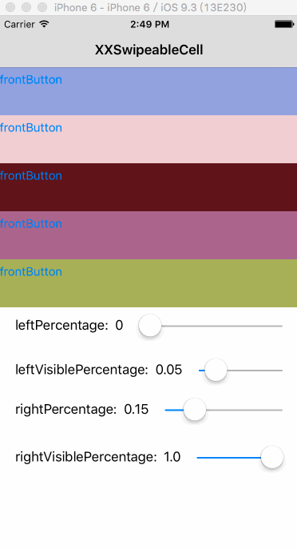

# XXSwipeableCell

 A simple, extensible, sliding `UITableViewCell` for Swift. Containing `frontView` and `backView`, the cell can be slided to left or right, and you can add any UI or action you want to the views on it. You can even decide the proportions they display in the cell and what percentage it will stay when you slide.

## Cocoapods

`XXSwipeableCell` is available through [CocoaPods](http://cocoapods.org). To install
it, simply add the following line to your Podfile:

```
pod "XXSwipeableCell"
```

## Usage

`XXSwipeableCell` is very simple to use. The most common usage way is creating custom `UITableViewCell`. Simply subclass `XXSwipeableCell` instead of `UITableViewCell`.

```
 let cell = tableView.dequeueReusableCellWithIdentifier("XXSwipeableCell") as! XXSwipeableCell;
```
`XXSwipeableCell` has provided the following public properties with their default value:

```
   
    /// The duration of the animation
    public var animationDuration = 0.2;
    
    /// The trigger ratio of left slide: 0<x<=1, if > 1 or <= 0 leftVisiblePercentage as a block sliding parameter
    public var leftPercentage: CGFloat = -1.0;
    
    /// The trigger ratio of right slide : 0<x<1, if > 1 or <= 0 rightVisiblePerCentage as a block sliding parameter
    public var rightPercentage: CGFloat = 0.15;
    
    /// The visible percentage on the left: 0 <= x <= 1
    public var leftVisiblePercentage: CGFloat = 0.05;
    
    /// The visible percentage on the right: 0 <= x <= 1
    public var rightVisiblePercentage: CGFloat = 1.0;
    
    /// Cover the entire screen, disappear when you click on the screen.
    public class XXOverlayView: UIView

```
When you restore the origin location of cell without calling the method : cell.close(true);  you have to remove the XXOverlayView Manually by calling the method : cell.overlayView?.removeFromSuperview(); Otherwise there will be some problems.

Then, you can adjust these properties to achieve the result that you want in your project. Such as:

```
        cell.leftPercentage = 0.25
        cell.leftVisiblePercentage = 0.3
        cell.rightPercentage = 0.25
        cell.rightVisiblePercentage = 0.5
```

In addition, you can add any UI and actions to the `frontView` or `backView` in `XXSwipeableCell`. I add a `UIButton` to both of them here :

```

       var button = UIButton(type: UIButtonType.System);
        button.setTitle("Button", forState: UIControlState.Normal);
        button.addTarget(self, action: #selector(ViewController.buttonAction(_:)), forControlEvents: UIControlEvents.TouchUpInside);
        button.sizeToFit();
        cell.backView.addSubview(button)
        button.tag = 100;
        
        button = UIButton(type: UIButtonType.System);
        button.setTitle("Button", forState: UIControlState.Normal);
        button.addTarget(self, action: #selector(ViewController.buttonAction(_:)), forControlEvents: UIControlEvents.TouchUpInside);
        button.sizeToFit();
        cell.frontView.addSubview(button);
        button.tag = 101;

```

The Demo in this project is an example:




